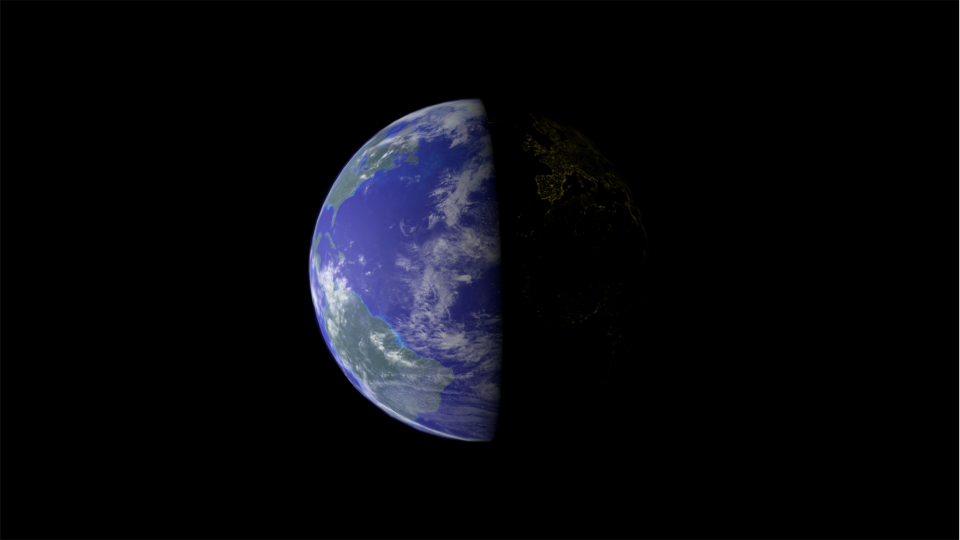

# Earth Website
This is a website about our glory planet, Earth.

## Usage
You have to have [yarn](https://classic.yarnpkg.com/en/docs/install/) to use this website. 

Cd to the diratory you cloned the project to and run:
```sh
yarn install
```

Then run the website:
```sh
yarn start
```

## Demo


Dem link: [https://hamzakhuswan.github.io/earth](https://hamzakhuswan.github.io/earth)


# Credit 
NASA (textures)