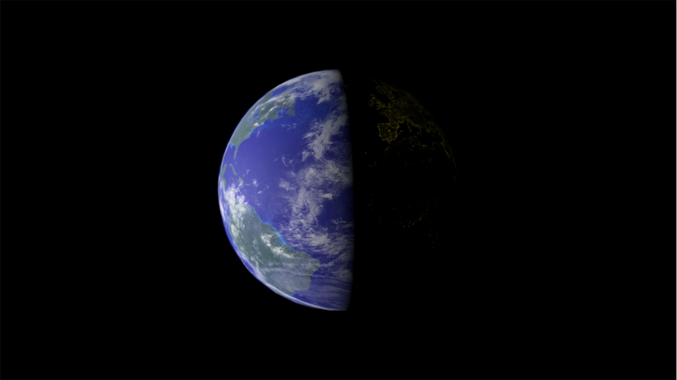

# Earth Website

This is a website about our glory planet, Earth.

## Usage

Cd to the directory you just cloned the project to and run:

```sh
npm install
```

Then run the website:

```sh
npm run dev
```

## Demo



# Credits to NASA

NASA is to be credited for the texture and sound assets used in this project.
